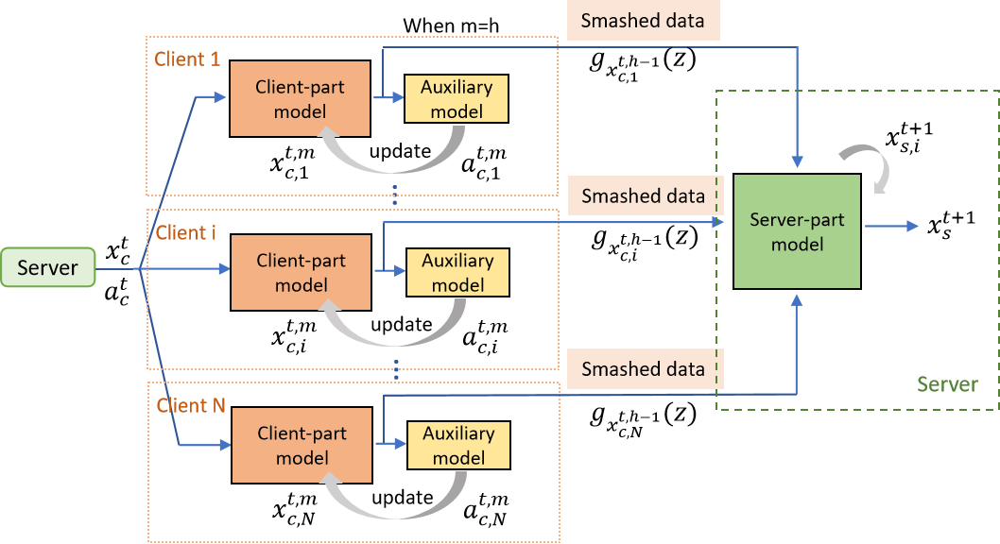

<div align="center">
  <h1 align="center">CSE_FSL: Communication and Storage Efficient Federated Split Learning</h1>
</div>

## Introduction

We have released the source code for our paper: 

CSE_FSL: [Communication and Storage Efficient Federated Split Learning](https://arxiv.org/pdf/2302.05599.pdf) (_ICC'2023_)

<div align="center">

</div>

### Abstract
Abstract—Federated learning (FL) is a popular distributed machine learning (ML) paradigm, but is often limited by significant communication costs and edge device computation capabilities. Federated Split Learning (FSL) preserves the parallel model training principle of FL, with a reduced device computation requirement thanks to splitting the ML model between the server and clients. However, FSL still incurs very high communication overhead due to transmitting the smashed data and gradients between the clients and the server in each global round. Furthermore, the server has to maintain separate models for every client, resulting in a significant computation and storage requirement that grows linearly with the number of clients. This paper aims at solving these two issues by proposing a communication and storage efficient federated split learning (CSE-FSL) strategy, which utilizes an auxiliary network to locally update the client models while keeping only a single model at the server, hence avoiding the communication of gradients from the server and greatly reducing the server resource requirement. Communication cost is further reduced by only sending the smashed data in selected epochs from the clients. We provide a rigorous theoretical analysis of CSE-FSL that guarantees its convergence for non-convex loss functions. Extensive experimental results demonstrate that CSE-FSL has a significant communication reduction over existing FSL techniques, while achieving state-of-the-art convergence and model accuracy, using several real-world FL tasks.

## How to run
* Cifar
```
python cse_fsl_main.py --dataset cifar -seed 200 -K 5 -U 5 -B 50 -E 1 --lr 0.15 --iid --gpu --test_round 1 --round 500 --save
```
* Femnist
```
python cse_fsl_main.py --dataset femnist -seed 200 -K 3500 -U 5 -B 10 -E 1 --lr 0.03 --noniid --gpu --test_round 1 --round 500 --save
```

## Citation

If you use this code in your research, please cite this paper.

```
@article{mu2023communication,
  title={Communication and Storage Efficient Federated Split Learning},
  author={Mu, Yujia and Shen, Cong},
  journal={arXiv preprint arXiv:2302.05599},
  year={2023}
}
```
